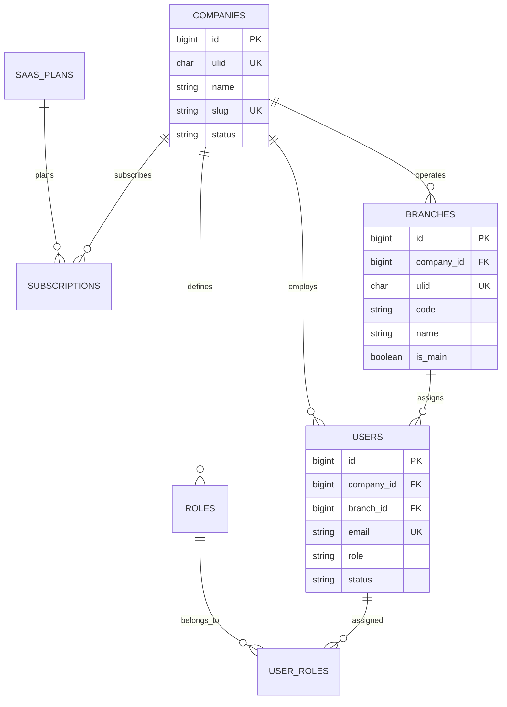
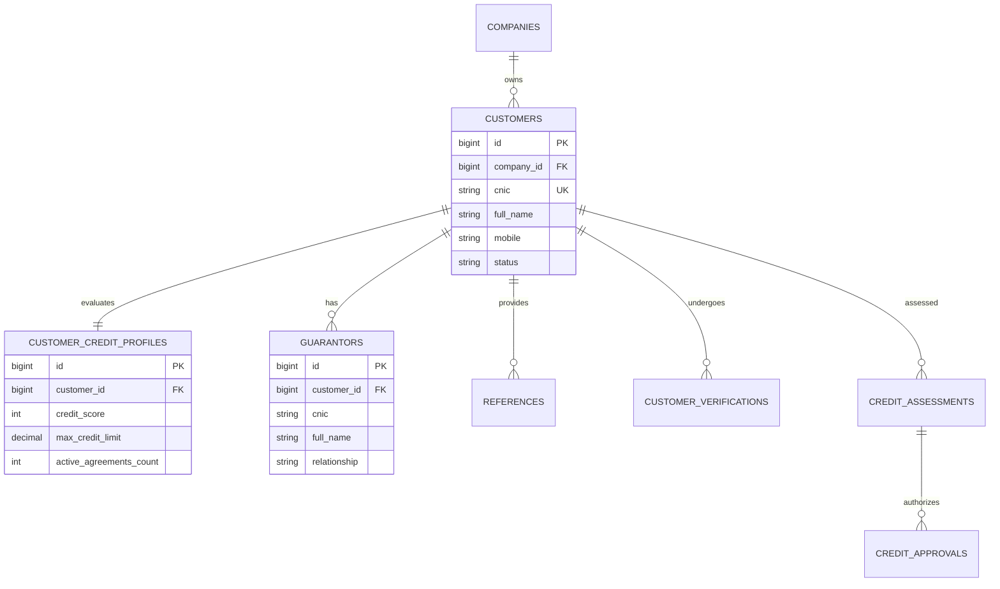
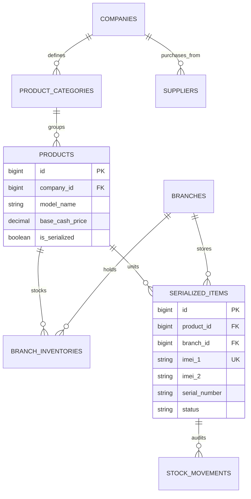
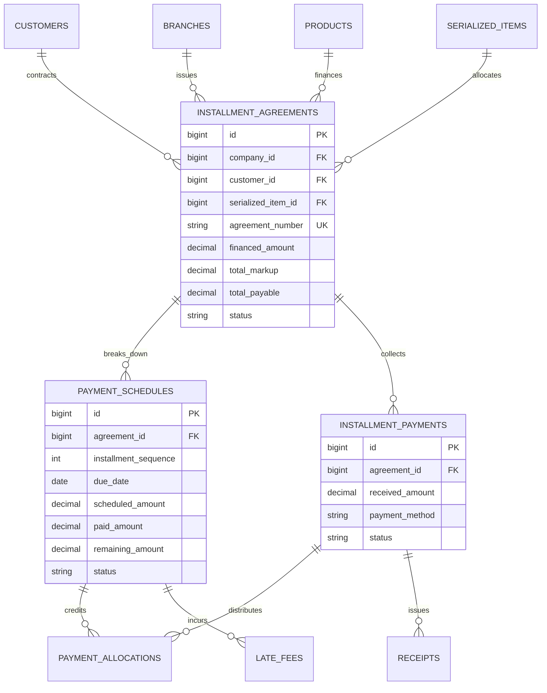

# Master Database Architecture & ERD Specifications

## 1. Architectural Standards & Design Conventions

- **Primary Keys**: Every table utilizes `id BIGINT UNSIGNED AUTO_INCREMENT PRIMARY KEY` for high-performance indexing, relational foreign keys, and internal joins.
- **Public Identifiers**: Every business entity exposed to users, URLs, QR codes, receipts, or APIs features a `ulid CHAR(26) UNIQUE` index.
- **Multi-Tenancy**: Every tenant-owned entity includes `company_id BIGINT UNSIGNED` referencing `companies(id)` with `CASCADE` on tenant removal.
- **Branch Ownership**: Operational entities include `branch_id BIGINT UNSIGNED NULLABLE` referencing `branches(id)`.
- **Database Engine**: MySQL 8.4 InnoDB, Charset `utf8mb4`, Collation `utf8mb4_unicode_ci`, Default String Length `191`.
- **Foreign Key Constraints**:
  - Metadata / Cascading Configuration: `ON DELETE CASCADE`.
  - Transactional / Audit Records: `ON DELETE RESTRICT` to prevent accidental loss of financial history.
  - Optional Assignments (e.g. branch, user): `ON DELETE SET NULL`.
- **Soft Deletion**: Applied across all customer, agreement, inventory, and user tables via `deleted_at TIMESTAMP NULLABLE`.
- **Audit Tracking**: `created_at`, `updated_at`, and polymorphic tracking (`created_by`, `updated_by`).

---

## 2. Core Relational Subsystem Diagrams (Mermaid)

### 2.1 Tenancy, Organization & RBAC

### 2.2 Customer Onboarding & Credit Underwriting

### 2.3 Product Catalog & Serialized Inventory

### 2.4 Installment Agreements, Schedules & Payment Allocations

---

## 3. Complete Master Table Specifications (34 Tables)

### Table 01: `saas_plans` (Platform Tier)
| Column | Type | Nullable | Default | Description |
| :--- | :--- | :---: | :---: | :--- |
| `id` | `BIGINT UNSIGNED AUTO_INCREMENT` | No | - | Primary Key |
| `ulid` | `CHAR(26)` | No | - | Unique Public Identifier |
| `name` | `VARCHAR(100)` | No | - | Plan Name (`Starter`, `Growth`, `Professional`, `Enterprise`) |
| `slug` | `VARCHAR(100)` | No | - | Unique Slug |
| `price_monthly` | `DECIMAL(12,2)` | No | `0.00` | Monthly subscription fee (PKR) |
| `price_yearly` | `DECIMAL(12,2)` | No | `0.00` | Discounted annual fee |
| `max_users` | `INT UNSIGNED` | No | `3` | Maximum user seats permitted |
| `max_branches` | `INT UNSIGNED` | No | `1` | Maximum physical showroom outlets |
| `max_active_agreements`| `INT UNSIGNED` | No | `100` | Maximum simultaneous open contracts |
| `features` | `JSON` | Yes | `NULL` | Feature flags (SMS, WhatsApp, Multi-warehouse) |
| `is_active` | `BOOLEAN` | No | `true` | Activation flag |
| `created_at` / `updated_at` | `TIMESTAMP` | Yes | `NULL` | Standard audit timestamps |

### Table 02: `companies` (Tenant Root)
| Column | Type | Nullable | Default | Description |
| :--- | :--- | :---: | :---: | :--- |
| `id` | `BIGINT UNSIGNED AUTO_INCREMENT` | No | - | Primary Key |
| `ulid` | `CHAR(26)` | No | - | Unique Public Identifier |
| `name` | `VARCHAR(191)` | No | - | Commercial Trade Name |
| `slug` | `VARCHAR(191)` | No | - | Unique Subdomain / Slug |
| `legal_name` | `VARCHAR(191)` | Yes | `NULL` | Registered Legal Entity Name |
| `ntn_strn` | `VARCHAR(50)` | Yes | `NULL` | National Tax Number / Sales Tax Registration |
| `phone` | `VARCHAR(30)` | Yes | `NULL` | Principal Business Contact Number |
| `email` | `VARCHAR(191)` | Yes | `NULL` | Official Corporate Email |
| `city` | `VARCHAR(100)` | Yes | `NULL` | Headquarters City |
| `address` | `TEXT` | Yes | `NULL` | Corporate Office Street Address |
| `currency` | `VARCHAR(10)` | No | `'PKR'` | Base Currency Token |
| `status` | `VARCHAR(20)` | No | `'active'` | Account Status (`active`, `trial`, `suspended`, `cancelled`) |
| `created_at` / `updated_at` | `TIMESTAMP` | Yes | `NULL` | Audit Timestamps |
| `deleted_at` | `TIMESTAMP` | Yes | `NULL` | Soft Deletes Flag |

### Table 03: `subscriptions` (Platform Tenant Billing)
| Column | Type | Nullable | Default | Description |
| :--- | :--- | :---: | :---: | :--- |
| `id` | `BIGINT UNSIGNED AUTO_INCREMENT` | No | - | Primary Key |
| `company_id` | `BIGINT UNSIGNED` | No | - | FK -> `companies(id)` ON DELETE CASCADE |
| `saas_plan_id` | `BIGINT UNSIGNED` | No | - | FK -> `saas_plans(id)` ON DELETE RESTRICT |
| `status` | `VARCHAR(20)` | No | `'active'` | `trial`, `active`, `past_due`, `suspended`, `cancelled` |
| `starts_at` | `DATETIME` | No | - | Subscription Start Date |
| `ends_at` | `DATETIME` | Yes | `NULL` | Subscription Expiration / Renewal Date |
| `trial_ends_at` | `DATETIME` | Yes | `NULL` | Free Trial Period Expiry |
| `created_at` / `updated_at` | `TIMESTAMP` | Yes | `NULL` | Timestamps |

### Table 04: `branches` (Physical Showroom Outlets)
| Column | Type | Nullable | Default | Description |
| :--- | :--- | :---: | :---: | :--- |
| `id` | `BIGINT UNSIGNED AUTO_INCREMENT` | No | - | Primary Key |
| `company_id` | `BIGINT UNSIGNED` | No | - | FK -> `companies(id)` ON DELETE CASCADE |
| `ulid` | `CHAR(26)` | No | - | Unique Public Identifier |
| `code` | `VARCHAR(30)` | No | - | Unique Branch Identifier per company (`LHR-01`, `FSD-01`) |
| `name` | `VARCHAR(191)` | No | - | Showroom / Branch Name |
| `city` | `VARCHAR(100)` | Yes | `NULL` | Physical City Location |
| `address` | `TEXT` | Yes | `NULL` | Showroom Physical Address |
| `phone` | `VARCHAR(30)` | Yes | `NULL` | Branch Contact Landline / Mobile |
| `email` | `VARCHAR(191)` | Yes | `NULL` | Branch Notification Email |
| `is_main` | `BOOLEAN` | No | `false` | True if Headquarters / Main Showroom |
| `status` | `VARCHAR(20)` | No | `'active'` | Branch State (`active`, `inactive`) |
| `created_at` / `updated_at` | `TIMESTAMP` | Yes | `NULL` | Timestamps |
| `deleted_at` | `TIMESTAMP` | Yes | `NULL` | Soft Deletes |
| **Unique Constraint** | `['company_id', 'code']` | - | - | Enforces unique branch code per company |

### Table 05: `users` (System Users & Staff)
| Column | Type | Nullable | Default | Description |
| :--- | :--- | :---: | :---: | :--- |
| `id` | `BIGINT UNSIGNED AUTO_INCREMENT` | No | - | Primary Key |
| `ulid` | `CHAR(26)` | No | - | Unique Public Identifier |
| `company_id` | `BIGINT UNSIGNED` | Yes | `NULL` | FK -> `companies(id)` (Null for Platform Superadmin) |
| `branch_id` | `BIGINT UNSIGNED` | Yes | `NULL` | FK -> `branches(id)` ON DELETE SET NULL |
| `name` | `VARCHAR(191)` | No | - | Full Legal Name |
| `email` | `VARCHAR(191)` | No | - | Unique Login Email Address |
| `password` | `VARCHAR(191)` | No | - | Bcrypt / Argon2 Hashed Secret |
| `role` | `VARCHAR(30)` | No | `'company_admin'` | System Role Enum |
| `status` | `VARCHAR(20)` | No | `'active'` | Security State (`active`, `suspended`, `inactive`) |
| `phone` | `VARCHAR(30)` | Yes | `NULL` | Mobile Contact Number |
| `avatar` | `VARCHAR(191)` | Yes | `NULL` | Profile Image Path |
| `last_login_at` | `DATETIME` | Yes | `NULL` | Security Audit Timestamp |
| `last_login_ip` | `VARCHAR(45)` | Yes | `NULL` | IPv4 / IPv6 Client Address |
| `remember_token` | `VARCHAR(100)` | Yes | `NULL` | Laravel Session Remember Token |
| `created_at` / `updated_at` | `TIMESTAMP` | Yes | `NULL` | Timestamps |
| `deleted_at` | `TIMESTAMP` | Yes | `NULL` | Soft Deletes |

### Table 06: `roles` & Table 07: `permissions` (RBAC)
- Standard spatie-compatible or native RBAC schemas scoped by `company_id` with `permissions` and `role_has_permissions`.

### Table 08: `customers` (Debtor Entity)
| Column | Type | Nullable | Default | Description |
| :--- | :--- | :---: | :---: | :--- |
| `id` | `BIGINT UNSIGNED AUTO_INCREMENT` | No | - | Primary Key |
| `company_id` | `BIGINT UNSIGNED` | No | - | FK -> `companies(id)` ON DELETE CASCADE |
| `ulid` | `CHAR(26)` | No | - | Unique Public Identifier |
| `cnic` | `VARCHAR(20)` | No | - | Pakistani CNIC `XXXXX-XXXXXXX-X` |
| `full_name` | `VARCHAR(191)` | No | - | Full Legal Name matching CNIC |
| `father_or_husband_name`| `VARCHAR(191)`| Yes | `NULL` | Family Relation Name |
| `gender` | `VARCHAR(10)` | No | `'male'` | `male`, `female`, `other` |
| `mobile_primary` | `VARCHAR(25)` | No | - | Primary Mobile (SMS notifications) |
| `mobile_secondary` | `VARCHAR(25)` | Yes | `NULL` | Alternative Contact Number |
| `whatsapp_number` | `VARCHAR(25)` | Yes | `NULL` | WhatsApp Communication Channel |
| `email` | `VARCHAR(191)` | Yes | `NULL` | Optional Email Address |
| `present_address` | `TEXT` | No | - | Current Physical Residence Address |
| `permanent_address` | `TEXT` | Yes | `NULL` | Address as stated on CNIC |
| `residence_type` | `VARCHAR(20)` | No | `'owned'` | `owned`, `rented`, `family` |
| `residence_tenure_years`| `INT UNSIGNED` | Yes | `NULL` | Years living at present address |
| `monthly_household_income`|`DECIMAL(12,2)`| Yes | `NULL` | Estimated Monthly Family Income |
| `utility_bill_ref_number`| `VARCHAR(50)` | Yes | `NULL` | Electricity/Gas Consumer Identifier |
| `status` | `VARCHAR(20)` | No | `'active'` | `pending_verification`, `active`, `restricted`, `blacklisted` |
| `created_at` / `updated_at` | `TIMESTAMP` | Yes | `NULL` | Timestamps |
| `deleted_at` | `TIMESTAMP` | Yes | `NULL` | Soft Deletes |
| **Unique Constraint** | `['company_id', 'cnic']` | - | - | Guarantees single unique debtor profile per tenant |

### Table 09: `customer_credit_profiles` (Underwriting History)
| Column | Type | Nullable | Default | Description |
| :--- | :--- | :---: | :---: | :--- |
| `id` | `BIGINT UNSIGNED AUTO_INCREMENT` | No | - | Primary Key |
| `customer_id` | `BIGINT UNSIGNED` | No | - | FK -> `customers(id)` ON DELETE CASCADE |
| `company_id` | `BIGINT UNSIGNED` | No | - | FK -> `companies(id)` ON DELETE CASCADE |
| `credit_score` | `INT UNSIGNED` | No | `50` | Dynamic Risk Score (0 = Default, 100 = Prime) |
| `max_authorized_credit` | `DECIMAL(12,2)` | No | `150000.00` | Maximum Financed Ceiling (PKR) |
| `active_agreements_count`| `INT UNSIGNED` | No | `0` | Count of currently open contracts |
| `completed_agreements_count`|`INT UNSIGNED`| No | `0` | Count of successfully closed contracts |
| `total_dpd_days` | `INT UNSIGNED` | No | `0` | Cumulative Days Past Due across history |
| `blacklisted_reason` | `TEXT` | Yes | `NULL` | Formal reason if blacklisted |
| `blacklisted_at` | `DATETIME` | Yes | `NULL` | Timestamp of blacklisting |
| `updated_at` | `TIMESTAMP` | Yes | `NULL` | Last Score Recalculation Date |

### Table 10: `guarantors` (Legal Guarantors)
| Column | Type | Nullable | Default | Description |
| :--- | :--- | :---: | :---: | :--- |
| `id` | `BIGINT UNSIGNED AUTO_INCREMENT` | No | - | Primary Key |
| `company_id` | `BIGINT UNSIGNED` | No | - | FK -> `companies(id)` ON DELETE CASCADE |
| `customer_id` | `BIGINT UNSIGNED` | No | - | FK -> `customers(id)` ON DELETE CASCADE |
| `ulid` | `CHAR(26)` | No | - | Unique Public Identifier |
| `cnic` | `VARCHAR(20)` | No | - | Guarantor CNIC `XXXXX-XXXXXXX-X` |
| `full_name` | `VARCHAR(191)` | No | - | Guarantor Full Legal Name |
| `relationship` | `VARCHAR(50)` | No | - | `brother`, `father`, `colleague`, `friend`, `uncle` |
| `occupation` | `VARCHAR(100)` | Yes | `NULL` | Employment / Business Title |
| `employer_name` | `VARCHAR(191)` | Yes | `NULL` | Company / Govt Department Name |
| `monthly_income` | `DECIMAL(12,2)` | Yes | `NULL` | Estimated Monthly Income |
| `mobile` | `VARCHAR(25)` | No | - | Mobile Contact Number |
| `address` | `TEXT` | No | - | Physical Residence / Workplace Address |
| `is_verified` | `BOOLEAN` | No | `false` | Physical/Telephonic Verification Flag |
| `created_at` / `updated_at` | `TIMESTAMP` | Yes | `NULL` | Timestamps |
| `deleted_at` | `TIMESTAMP` | Yes | `NULL` | Soft Deletes |

### Table 11: `references` (Personal References)
| Column | Type | Nullable | Default | Description |
| :--- | :--- | :---: | :---: | :--- |
| `id` | `BIGINT UNSIGNED AUTO_INCREMENT` | No | - | Primary Key |
| `company_id` | `BIGINT UNSIGNED` | No | - | FK -> `companies(id)` |
| `customer_id` | `BIGINT UNSIGNED` | No | - | FK -> `customers(id)` |
| `full_name` | `VARCHAR(191)` | No | - | Reference Full Name |
| `relationship` | `VARCHAR(50)` | No | - | Acquaintance Relation |
| `mobile` | `VARCHAR(25)` | No | - | Mobile Number |
| `address` | `TEXT` | Yes | `NULL` | Residence Location |
| `created_at` | `TIMESTAMP` | Yes | `NULL` | Creation Timestamp |

### Table 12: `customer_verifications` (Field Investigation Audits)
| Column | Type | Nullable | Default | Description |
| :--- | :--- | :---: | :---: | :--- |
| `id` | `BIGINT UNSIGNED AUTO_INCREMENT` | No | - | Primary Key |
| `company_id` | `BIGINT UNSIGNED` | No | - | FK -> `companies(id)` |
| `customer_id` | `BIGINT UNSIGNED` | No | - | FK -> `customers(id)` |
| `verified_by_user_id` | `BIGINT UNSIGNED` | No | - | FK -> `users(id)` (Credit Investigator) |
| `verification_type` | `VARCHAR(30)` | No | `'field_visit'` | `field_visit`, `telephonic`, `utility_bill` |
| `residence_confirmed` | `BOOLEAN` | No | `true` | Physical address validated |
| `workplace_confirmed` | `BOOLEAN` | Yes | `NULL` | Employment validated |
| `investigator_notes` | `TEXT` | Yes | `NULL` | Qualitative assessment notes |
| `outcome` | `VARCHAR(20)` | No | `'approved'` | `approved`, `conditional`, `rejected` |
| `verified_at` | `DATETIME` | No | - | Verification Date & Time |

### Table 13: `credit_assessments` & Table 14: `credit_approvals`
- Records quantitative score calculation, Debt-to-Income (DTI) ratio, committee notes, approval milestone level (Level 1 Branch Manager, Level 2 Company Director), and approval timestamp.

### Table 15: `product_categories` & Table 16: `suppliers`
- Hierarchical product taxonomy (Smartphones, Televisions, Refrigerators, Solar) and commercial distributors supplying wholesale stock.

### Table 17: `products` (Catalog Master)
| Column | Type | Nullable | Default | Description |
| :--- | :--- | :---: | :---: | :--- |
| `id` | `BIGINT UNSIGNED AUTO_INCREMENT` | No | - | Primary Key |
| `company_id` | `BIGINT UNSIGNED` | No | - | FK -> `companies(id)` ON DELETE CASCADE |
| `category_id` | `BIGINT UNSIGNED` | No | - | FK -> `product_categories(id)` |
| `ulid` | `CHAR(26)` | No | - | Unique Public Identifier |
| `brand` | `VARCHAR(100)` | No | - | Manufacturer Brand (`Samsung`, `Haier`, `Apple`) |
| `model_name` | `VARCHAR(191)` | No | - | Model Designation (`Galaxy S25 Ultra`, `1.5 Ton Inverter AC`) |
| `sku` | `VARCHAR(50)` | Yes | `NULL` | Internal Stock Keeping Unit |
| `base_cash_price` | `DECIMAL(12,2)` | No | - | Showroom Cash Retail Price (PKR) |
| `min_down_payment_pct`| `DECIMAL(5,2)` | No | `20.00` | Minimum Down Payment % required |
| `is_serialized` | `BOOLEAN` | No | `true` | True = Mandatory IMEI/Serial tracking |
| `is_active` | `BOOLEAN` | No | `true` | Catalog Visibility Flag |
| `created_at` / `updated_at` | `TIMESTAMP` | Yes | `NULL` | Timestamps |
| `deleted_at` | `TIMESTAMP` | Yes | `NULL` | Soft Deletes |

### Table 18: `branch_inventories` (Aggregated Stock Levels)
| Column | Type | Nullable | Default | Description |
| :--- | :--- | :---: | :---: | :--- |
| `id` | `BIGINT UNSIGNED AUTO_INCREMENT` | No | - | Primary Key |
| `company_id` | `BIGINT UNSIGNED` | No | - | FK -> `companies(id)` |
| `branch_id` | `BIGINT UNSIGNED` | No | - | FK -> `branches(id)` |
| `product_id` | `BIGINT UNSIGNED` | No | - | FK -> `products(id)` |
| `quantity_on_hand` | `INT` | No | `0` | Total physical units in showroom |
| `quantity_reserved`| `INT` | No | `0` | Units held pending contract down payment |
| `quantity_available`|`INT` | No | `0` | Net sellable units ($Q_{\text{on\_hand}} - Q_{\text{reserved}}$) |
| **Unique Constraint** | `['branch_id', 'product_id']` | - | - | Single aggregated stock line per branch product |

### Table 19: `serialized_items` (Unique Hardware Units)
| Column | Type | Nullable | Default | Description |
| :--- | :--- | :---: | :---: | :--- |
| `id` | `BIGINT UNSIGNED AUTO_INCREMENT` | No | - | Primary Key |
| `company_id` | `BIGINT UNSIGNED` | No | - | FK -> `companies(id)` |
| `branch_id` | `BIGINT UNSIGNED` | No | - | FK -> `branches(id)` (Current physical showroom) |
| `product_id` | `BIGINT UNSIGNED` | No | - | FK -> `products(id)` |
| `ulid` | `CHAR(26)` | No | - | Unique Public Identifier |
| `imei_1` | `VARCHAR(50)` | Yes | `NULL` | Primary 15-digit IMEI number |
| `imei_2` | `VARCHAR(50)` | Yes | `NULL` | Secondary Dual-SIM IMEI number |
| `serial_number` | `VARCHAR(100)`| Yes | `NULL` | Factory Serial Number |
| `asset_tag` | `VARCHAR(50)` | Yes | `NULL` | Internal Barcode / Asset Sticker |
| `color` | `VARCHAR(50)` | Yes | `NULL` | Unit Finish / Color Variant |
| `status` | `VARCHAR(30)` | No | `'in_stock'`| `in_stock`, `reserved`, `allocated`, `disbursed`, `repossessed` |
| `purchase_cost` | `DECIMAL(12,2)` | Yes | `NULL` | Wholesale Cost Basis |
| `created_at` / `updated_at` | `TIMESTAMP` | Yes | `NULL` | Timestamps |
| **Unique Constraints**| `['company_id', 'imei_1']`, `['company_id', 'serial_number']` | Unique per company |

### Table 20: `stock_movements` (Inventory Audit Log)
- Tracks movement type (`purchase_receipt`, `branch_transfer_out`, `branch_transfer_in`, `sale_disbursement`, `repossession_return`, `manual_adjustment`), source branch, destination branch, serialized item ID, initiating user ID, and timestamp.

### Table 21: `installment_plans` (Plan Templates)
- Company financing templates: tenure in months (3, 6, 12, 18, 24), markup calculation model, standard markup percentage, minimum down payment %, and active state.

### Table 22: `installment_agreements` (Master Contract Entity)
| Column | Type | Nullable | Default | Description |
| :--- | :--- | :---: | :---: | :--- |
| `id` | `BIGINT UNSIGNED AUTO_INCREMENT` | No | - | Primary Key |
| `company_id` | `BIGINT UNSIGNED` | No | - | FK -> `companies(id)` ON DELETE RESTRICT |
| `branch_id` | `BIGINT UNSIGNED` | No | - | FK -> `branches(id)` (Issuing Branch) |
| `customer_id` | `BIGINT UNSIGNED` | No | - | FK -> `customers(id)` ON DELETE RESTRICT |
| `product_id` | `BIGINT UNSIGNED` | No | - | FK -> `products(id)` |
| `serialized_item_id` | `BIGINT UNSIGNED`| Yes | `NULL` | FK -> `serialized_items(id)` (Allocated Unit) |
| `sales_officer_id` | `BIGINT UNSIGNED`| No | - | FK -> `users(id)` |
| `approver_id` | `BIGINT UNSIGNED`| Yes | `NULL` | FK -> `users(id)` (Branch Manager) |
| `ulid` | `CHAR(26)` | No | - | Unique Public Identifier |
| `agreement_number` | `VARCHAR(50)` | No | - | Human-readable contract # (`AGR-2026-00123`) |
| `cash_price` | `DECIMAL(12,2)` | No | - | Showroom Cash Retail Price |
| `down_payment_agreed`| `DECIMAL(12,2)` | No | - | Agreed Upfront Down Payment |
| `down_payment_paid` | `DECIMAL(12,2)` | No | `0.00` | Actual Down Payment Received & Confirmed |
| `financed_principal`| `DECIMAL(12,2)` | No | - | Financed Capital ($CP - DP$) |
| `markup_rate_pct` | `DECIMAL(5,2)` | No | - | Effective Annualized / Flat Markup % |
| `standard_markup` | `DECIMAL(12,2)` | No | - | Original Calculated Standard Markup |
| `negotiated_markup`| `DECIMAL(12,2)` | No | - | Final Agreed Markup Amount |
| `total_payable` | `DECIMAL(12,2)` | No | - | Total Contract Amount ($DP + FA + M$) |
| `total_paid` | `DECIMAL(12,2)` | No | `0.00` | Cumulative Cash Received |
| `remaining_balance` | `DECIMAL(12,2)` | No | - | Outstanding Balance ($TP - \text{Paid}$) |
| `tenure_months` | `INT UNSIGNED` | No | `12` | Contract Duration in Months |
| `installment_frequency`|`VARCHAR(20)`| No | `'monthly'` | `monthly`, `bi_weekly`, `weekly` |
| `monthly_installment`|`DECIMAL(12,2)`| No | - | Base Scheduled Installment Amount |
| `negotiation_notes` | `TEXT` | Yes | `NULL` | Reason for markup discount / deviations |
| `status` | `VARCHAR(30)` | No | `'draft'` | `draft`, `approved`, `disbursed`, `active`, `completed`, `defaulted`, `cancelled` |
| `agreement_date` | `DATE` | No | - | Contract Execution Date |
| `first_due_date` | `DATE` | No | - | First Scheduled Installment Date |
| `completed_at` | `DATETIME` | Yes | `NULL` | Date of final installment payoff |
| `created_at` / `updated_at` | `TIMESTAMP` | Yes | `NULL` | Timestamps |
| `deleted_at` | `TIMESTAMP` | Yes | `NULL` | Soft Deletes |
| **Unique Constraint** | `['company_id', 'agreement_number']` | - | - | Unique agreement identifier per tenant |

### Table 23: `payment_schedules` (Installment Due Dates)
| Column | Type | Nullable | Default | Description |
| :--- | :--- | :---: | :---: | :--- |
| `id` | `BIGINT UNSIGNED AUTO_INCREMENT` | No | - | Primary Key |
| `company_id` | `BIGINT UNSIGNED` | No | - | FK -> `companies(id)` |
| `agreement_id` | `BIGINT UNSIGNED` | No | - | FK -> `installment_agreements(id)` ON DELETE CASCADE |
| `installment_sequence`| `INT UNSIGNED` | No | - | Sequence index (Month 1, Month 2, ... Month 12) |
| `due_date` | `DATE` | No | - | Formal Payment Due Date |
| `principal_component`| `DECIMAL(12,2)` | No | - | Portion satisfying financed principal |
| `markup_component` | `DECIMAL(12,2)` | No | - | Portion satisfying profit markup |
| `scheduled_amount` | `DECIMAL(12,2)` | No | - | Total Installment Due ($Principal + Markup$) |
| `paid_amount` | `DECIMAL(12,2)` | No | `0.00` | Cumulative Amount Paid towards this installment |
| `remaining_amount` | `DECIMAL(12,2)` | No | - | Outstanding installment balance |
| `status` | `VARCHAR(20)` | No | `'unpaid'` | `unpaid`, `partially_paid`, `paid` |
| `paid_at` | `DATETIME` | Yes | `NULL` | Timestamp when remaining amount hit zero |

### Table 24: `installment_payments` (Received Transactions)
| Column | Type | Nullable | Default | Description |
| :--- | :--- | :---: | :---: | :--- |
| `id` | `BIGINT UNSIGNED AUTO_INCREMENT` | No | - | Primary Key |
| `company_id` | `BIGINT UNSIGNED` | No | - | FK -> `companies(id)` |
| `agreement_id` | `BIGINT UNSIGNED` | No | - | FK -> `installment_agreements(id)` |
| `collecting_branch_id`|`BIGINT UNSIGNED`| No | - | FK -> `branches(id)` (Physical location of payment) |
| `collected_by_user_id`|`BIGINT UNSIGNED`| No | - | FK -> `users(id)` (Cashier or Collection Officer) |
| `acknowledged_by_user_id`|`BIGINT UNSIGNED`| Yes | `NULL`| FK -> `users(id)` (Branch Cashier who verified cash) |
| `ulid` | `CHAR(26)` | No | - | Unique Public Identifier |
| `payment_type` | `VARCHAR(30)` | No | `'installment'`| `down_payment`, `installment`, `late_fee`, `settlement` |
| `payment_method` | `VARCHAR(30)` | No | `'cash'` | `cash`, `bank_transfer`, `cheque`, `raast`, `easypaisa`, `jazzcash` |
| `received_amount` | `DECIMAL(12,2)` | No | - | Total Gross Cash/Bank Funds Received |
| `transaction_reference`|`VARCHAR(100)` | Yes | `NULL` | Bank Slip #, Raast Ref, or Cheque # |
| `status` | `VARCHAR(30)` | No | `'submitted'` | `submitted`, `pending_verification`, `acknowledged`, `reversed` |
| `collected_at` | `DATETIME` | No | - | Transaction Timestamp |
| `acknowledged_at` | `DATETIME` | Yes | `NULL` | Formal Drawer Posting Timestamp |
| `notes` | `TEXT` | Yes | `NULL` | Cashier Remarks |
| `created_at` / `updated_at` | `TIMESTAMP` | Yes | `NULL` | Append-only timestamps |

### Table 25: `payment_allocations` (Ledger Line Distribution)
| Column | Type | Nullable | Default | Description |
| :--- | :--- | :---: | :---: | :--- |
| `id` | `BIGINT UNSIGNED AUTO_INCREMENT` | No | - | Primary Key |
| `payment_id` | `BIGINT UNSIGNED` | No | - | FK -> `installment_payments(id)` ON DELETE RESTRICT |
| `schedule_id` | `BIGINT UNSIGNED` | Yes | `NULL` | FK -> `payment_schedules(id)` |
| `late_fee_id` | `BIGINT UNSIGNED` | Yes | `NULL` | FK -> `late_fees(id)` |
| `allocation_type` | `VARCHAR(30)` | No | - | `late_fee`, `overdue_principal`, `overdue_markup`, `current_installment`, `advance` |
| `allocated_amount` | `DECIMAL(12,2)` | No | - | Exact Dollar Amount Credited |
| `created_at` | `TIMESTAMP` | Yes | `NULL` | Immutable Allocation Timestamp |

### Table 26: `receipts` (Numbered Print Tokens)
| Column | Type | Nullable | Default | Description |
| :--- | :--- | :---: | :---: | :--- |
| `id` | `BIGINT UNSIGNED AUTO_INCREMENT` | No | - | Primary Key |
| `company_id` | `BIGINT UNSIGNED` | No | - | FK -> `companies(id)` |
| `payment_id` | `BIGINT UNSIGNED` | No | - | FK -> `installment_payments(id)` |
| `receipt_number` | `VARCHAR(50)` | No | - | Formatted Receipt Token (`REC-2026-08912`) |
| `receipt_token` | `VARCHAR(64)` | No | - | SHA-256 Verification Hash for QR Code scanning |
| `print_count` | `INT UNSIGNED` | No | `1` | Tracks reprint frequency for audit safety |
| `issued_at` | `DATETIME` | No | - | Issue Timestamp |

### Table 27: `late_fees` & Table 28: `late_fee_waivers`
- **`late_fees`**: `agreement_id`, `schedule_id`, `fee_amount`, `days_overdue`, `status` (`accrued`, `partially_paid`, `paid`, `waived`).
- **`late_fee_waivers`**: `late_fee_id`, `agreement_id`, `waived_by_user_id`, `original_fee_amount`, `waived_amount`, `reason_justification`, `waived_at`.

### Table 29: `recovery_policies` (Escalation Configuration)
- Company-specific recovery rules: grace days, reminder SMS interval, telephonic escalation days, field visit assignment days, legal notice days, and repossession threshold.

### Table 30: `customer_visits` (Field Recovery Logs)
- `collection_officer_id`, `customer_id`, `agreement_id`, `visit_date`, `customer_contacted` (boolean), `contact_outcome`, `promise_to_pay_date`, `promised_amount`, `geo_latitude`, `geo_longitude`, `visit_notes`.

### Table 31: `cash_drawers` (Daily Till Reconciliations)
- `branch_id`, `cashier_user_id`, `shift_date`, `opening_balance`, `cash_collected`, `cash_disbursed`, `closing_physical_cash`, `variance_amount`, `status` (`open`, `closed`, `reconciled`).

### Table 32: `financial_ledger_entries` (Append-Only Journal)
- General ledger tracking for double-entry financial reporting: `company_id`, `branch_id`, `transaction_date`, `account_code`, `debit`, `credit`, `reference_type`, `reference_id`, `description`.

### Table 33: `notifications` & Table 34: `audit_logs`
- Multi-channel outbound dispatch logs (SMS, WhatsApp, Email delivery status) and polymorphic system audit records (`auditable_type`, `auditable_id`, `action`, `old_values`, `new_values`, `ip_address`, `user_id`).
